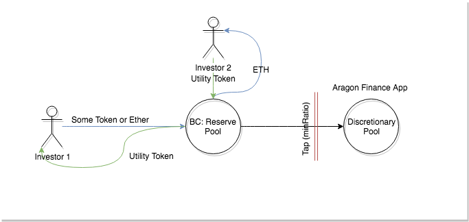

# Development Plan

## **Release 0.1 \| 4 weeks**

[Create crowdfunding smart contracts in Aragon](https://4ire-labs.gitbook.io/apiary/development-plan/0-1)

* Detailed specifications for the further stages
* Aragon app smart contract 
* OpenZeppelin based crowdsale smart contracts
* ACL setup for Aragon app and crowdsale smart contracts
* Aragon-UI based front-end that allows to create campaigns through Aragon voting process

## **Release 0.2 \| 4 weeks**

### Reserve pool & Tap

* Reserve pool smart contract that will hold money raised from fundrisng campaigns
* Tap functionality - the minRatio parameter ensures that the Bonding Curve remains a functional source of liquidity for the project.

#### Restricted token minting

Initial token minting will be restricted to the Apiary Application.

#### Tap

Funds which have moved from the bonding curve’s reserve pool to the organization’s discretionary pool can be directly governed by the organization \(see section 3 for more details\). These funds can be used to reward contributors to the project.

## **Release 0.3 \| 4 weeks**

Utility token minting & Bancor pricing formula

* Mint utility token in behalf of investments
* Develop bonding curve based on Bancor pricing formula

## **Release 0.4 \| 4 weeks**

Instant liquidation & Testnet release

* Instant liquidation functionality - process that can unblock all funds in liquidity pool in critical situation. \(Possibly - another voting mechanism\) 

## **Release 0.5 \| 6 weeks**

Advanced terms and new crowdfunding contracts

## **Release 1.0 \| 8-12 weeks**

Audit / Bug bounty on the testnet

$17.5k for bounties and mainnet release

### 

### 

### Development Approach

Agile / Scrum. 2 weeks sprints: demo report \(public\) / retro / planning.

