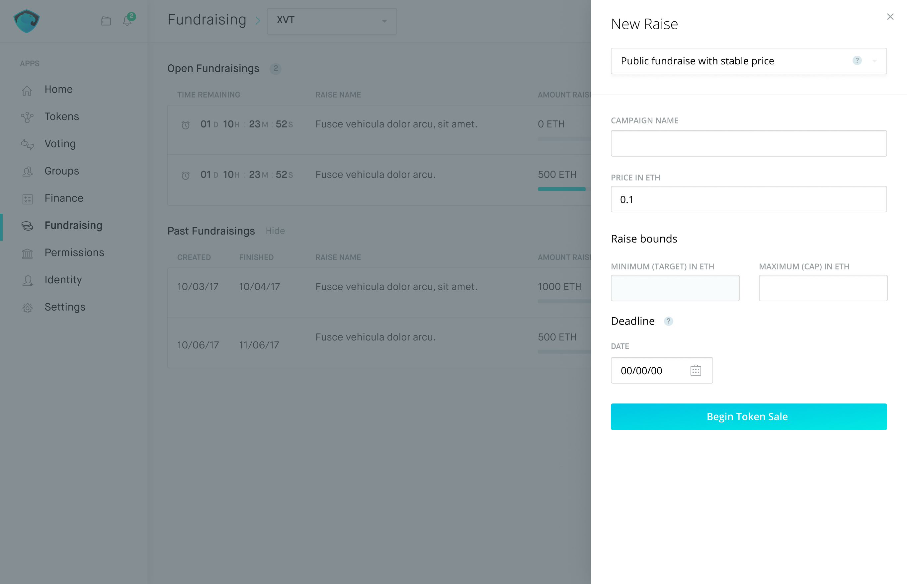

# Create crowdfunding smart contracts in Aragon

? how do we treat initial token minting that we have in Aragon ?

## Fundraising app

The task is done in the new Fundraising app.

## Creation of a fundraising campaign

Terms: simplest option, public with stable price. In the initial version min is tight to 0, so there's no return. After expiration of the deadline all collected funds go directly to the org account \(before we implement the tap\).

Campaign name e.g. "Round 1"

Price and Min/Max caps are set in Ethereum

